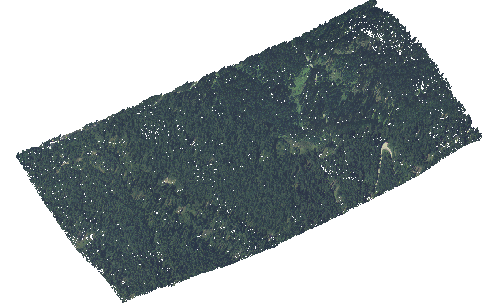

======================================
Calculate Canopy Height Model (CHM)
======================================

:Author: Luca Delucchi
:Contact: luca.delucchi@fmach.it
:Date: 22/12/2016

Introduction
-----------------

This tutorial describes how to calculate the Canopy Height Model (CHM).
For each point of your point cloud dataset it calculate a new height as
result of subtraction of the point's height with the value of a
`Digital Terrain Model`_ (DTM).
The tutorial describes how to create a pipeline to get the CHM point
cloud file.

Requirements
-----------------
To run this tutorial it is required to have installed PDAL and the
Python libraries `numpy`_ and `GDAL`_.

This tutorial utilizes a Trentino dataset, it includes a LAZ file and a
DTM tif file. You can download it from
.. TODO add link

   The input data: a forest area in Trentino

Approach
---------------
To calculate the CHM it is required to link three different operation.

The first operation is to cut the input LAS file according to the DTM,
for this it us the :ref:`filters.crop`. In the crop filter it is
possible to use or a bounding box or a polygon as input. This step is
really useful specially if the two input files have different extension.
If the DTM is smaller of LAS then the process can gain a lot time.

The second operation is the real analysis to calculate the CHM using a
:ref:`filters.programmable`. For each point it get the value of DTM,
using GDAL Python library, for the point's coordinates and save the new
height.

The last step is to clean the previous output, sometimes, due to unclear
reasons, GDAL is not able to return a value so the new height is set to
None, with this last step it is going to remove all the points with
null height. This process run a :ref:`filters.predicate`.

Pipeline
--------------------
The following code is the complete Pipeline

.. code-block:: xml

    <Pipeline version="1.0">
      <Writer type="writers.las">
        <Option name="filename">chm.las</Option>
        <Option name="compression">true</Option>
          <Filter type="filters.predicate">
            <Option name="function">filter</Option>
            <Option name="module">anything</Option>
            <Option name="source">
    import numpy as np

    def filter(ins,outs):
        cls = ins['Z']

        excluded_classes = [None]

        keep = np.not_equal(cls, excluded_classes[0])

        outs['Mask'] = keep
        return True
            </Option>
            <Filter type="filters.programmable">
            <Option name="function">chm</Option>
            <Option name="module">anything</Option>
            <Option name="source">
    import numpy as np
    import struct
    import osgeo.gdal as gdal

    def get_value(x,y, band, band_type, geomt):
        px = int((x - geomt[0]) / geomt[1])  # x pixel
        py = int((y - geomt[3]) / geomt[5])  # y pixel
        try:
            structval = band.ReadAsArray(px, py, 1, 1)
            val = structval[0][0]
            if cmp(val, 0) == -1:
                val = 0
            return val
        except:
            return None

    def chm(ins,outs):
        inrast = 'dtm.tif'
        rast = gdal.Open(inrast)
        band = rast.GetRasterBand(1)
        geomtransf = rast.GetGeoTransform()
        band_type = band.DataType
        Zs = ins['Z']
        Xs = ins['X']
        Ys = ins['Y']
        newZ = []
        for i in range(len(Xs)):
            try:
                z = get_value(Xs[i], Ys[i], band, band_type, geomtransf)
            except:
                z = None
            if z:
                z = Zs[i] - z
                if cmp(z,0) == -1:
                    z = 0
            newZ.append(z)
        outs['Z'] = np.array(newZ)
        return True
            </Option>
            <Filter type="filters.crop">
              <Option name="polygon">POLYGON ((711348.5 5129215.5,711348.5 5132163.5,713522.5 5132163.5,713522.5 5129215.5,711348.5 5129215.5))</Option>
              <Reader type="readers.las">
                <Option name="filename">trentino.laz</Option>
              </Reader>
            </Filter>
          </Filter>
        </Filter>
      </Writer>
    </Pipeline>

To run this code with your own data you have to modify the following
elements:

* The input LAS data for :ref:`readers.las`
* The polygon for :ref:`filters.crop`, you have to set the bounding box
  of the DTM, you can get it using `gdalinfo`_ or a GIS software like
  `QGIS`_
* The DTM file inside the Python code of :ref:`filters.programmable`
* The output LAS file for :ref:`writers.las`

Of course you can use different :ref:`reader <readers>` or
:ref:`writer <writers>`

.. _`Digital Terrain Model`: https://en.wikipedia.org/wiki/Digital_elevation_model
.. _`numpy`: http://www.numpy.org/
.. _`GDAL`: https://pypi.python.org/pypi/GDAL
.. _`gdalinfo`: http://www.gdal.org/gdalinfo.html
.. _`QGIS`: http://www.qgis.org